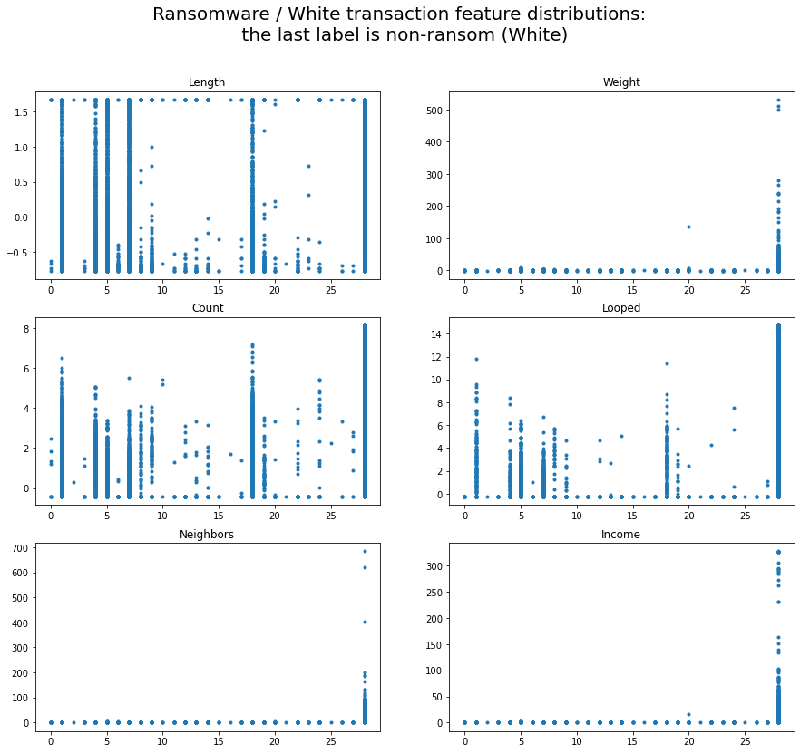
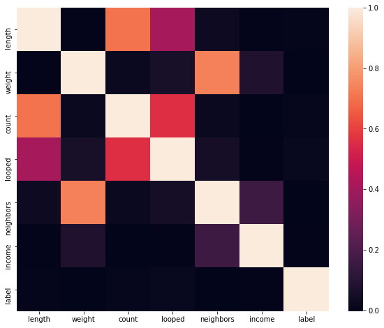
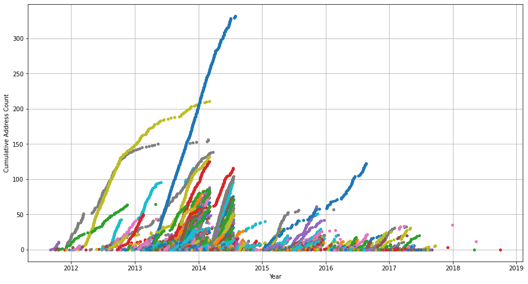
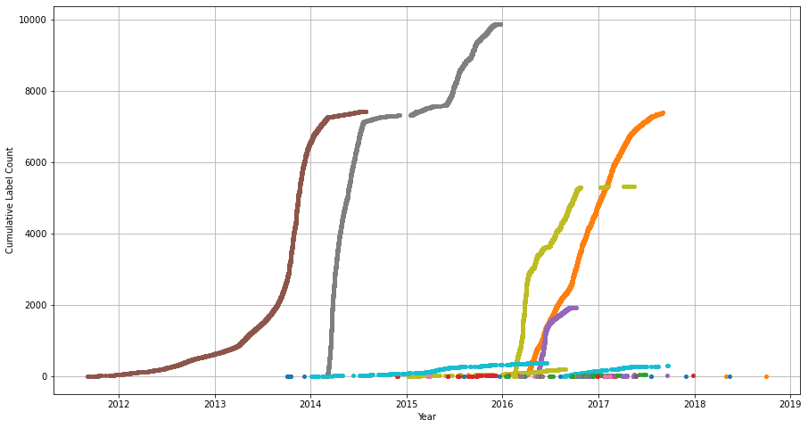
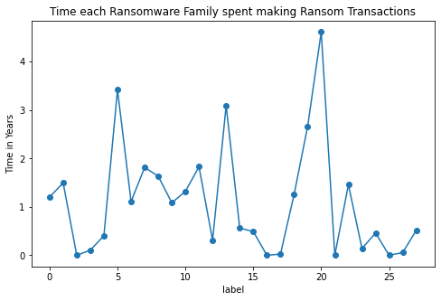
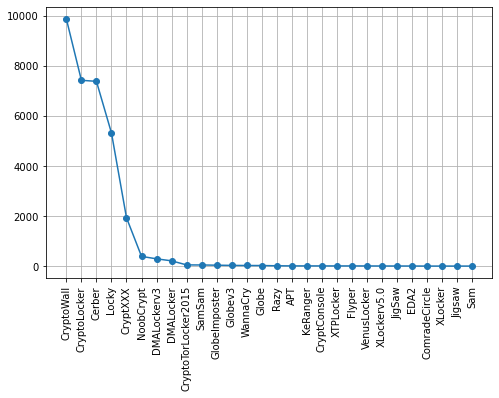

# DataHacks2021: Bitcoin Ransomware Analysis

Given a dataset of Bitcoin transactions, we have created a model to classify transactions into illicit (ransomware) or non-illict (white) categories. Furthermore, upon identifying a ransomware transaction we were able to classify the transactions into the family it most likely originated from.
Edit: placed second in the Intermediate Track.

### Dependencies

- Pandas
- NumPy/SciPy
- SciKitLearn
- MatPlotLib/Seaborn
- XGBoost

### Execution

`python bitcoin-modeling.py` Will run the extent of our analysis. If the variable `PROD` is changed to `False`, it will run the training / testing analysis done in model selection. This will take longer.

### Authors

Jacob and Tyler Benson

### References:

> Akcora, C. G., Li, Y., Gel, Y. R., &amp; Kanatarcioglu, M. (n.d.). BitcoinHeist: Topological Data Analysis for Ransomware Detection on the Bitcoin Blockchain [PDF].

> Lennon, H. (2021, January 20). The false narrative of bitcoin's role in illicit activity. Retrieved April 10, 2021, from https://www.forbes.com/sites/haileylennon/2021/01/19/the-false-narrative-of-bitcoins-role-in-illicit-activity/?sh=7d92ed423432

> Team, C. (2021, January 19). Crypto crime Summarized: Scams and darknet markets DOMINATED 2020 by revenue, But ransomware is the bigger story. Retrieved April 10, 2021, from https://blog.chainalysis.com/reports/2021-crypto-crime-report-intro-ransomware-scams-darknet-markets


# Our Report is Appended below


## Introduction

Bitcoin was invented in 2008 by an unknown source under the pseudonym "Satoshi Nakamoto". It was designed to be a currency free from censorship and the blind trust that goes into conventional currencies. Satoshi intended to put that trust into the hands of the people, making the bitcoin network entirely peer-to-peer based with a universally distributed public ledger for transactions and no centralized authoritative figure. Both because of this and despite it, bitcoin quickly peaked the interest of those connected with illegal activities. Through bitcion, these activities could be funded with little to no fear of discovery by "laundering" the bitcoin through many channels. This makes it essentially impossible to trace back any one bitcoin user to a transaction made for illicit activities. Such groups began collecting money through bitcoin by infecting computers with viruses and demanding payment in return for access to their computer, known as ransomware. In this report we will attempt to distinguish ransomware transactions from 'white' or non-illicit transactions and classify the ransomware transactions into the different 'families' or groups instagating them.

## Data

The supplied dataset consist of two qualitative variables (address and label) and 8 quantitative variables (year, day, length, weight, count, looped, neighbors, and income). The address is the unique identifier of the bitcoin being transacted. Label denotes both the nature of the transaction and the name of the ransomware family responsible for the illicit transaction (e.g., CryptXXX, CryptoLocker, etc.). The year and day variables tell us when the transaction was made and the income variable is roughly how much (in Satoshi, where 1 bitcoin = 100 million Satoshi) the transaction was worth. The other quantitative variables were collected in a particular fashion. Each day was monitored individually where the values for the variables were based solely on the information gathered that day. The length variable represents the largest number of transactions that occurred that day with the given address prior to the given transaction, or the most transactions after the first transaction of the day that led to the transaction in question. The weight variable quantifies merge behavior of previous transactions. For all transactions leading to the one, weight is the fraction of bitcoin from transactions that led to the one in question over the total number of output bitcoins. Count is the amount of starter transactions (first transaction of the day) that led to the given transaction. And finally loop represents the number of starter transactions that led to the transaction in question that happen to have more than one path, meaning loop counts the number of splits, moves through different transactions, and merges to a new, singular address, for the address of the transaction.

## Preprocessing

First, we wanted to encode both the addresses and labels. Instead of having strings denoting our variables, such as "1BpvJgUs..." for an address, we converted them to integers to make parsing and manipulation much faster. Next, we added a 'date' column which combined the 'year' and 'day' columns by adding the fraction of the year on which day occured to the 'year' column. We then sorted by 'date' to put the transactions into chronological order. After this, we then added columns denoting the number of times each address was repeated, and the time it was seen (ie. first, second, third, etc.). We then did the same for labels, so as to see the progressing of the different ransomware families over time. Finally, we standardized the numerical features described above by subtracting the mean and dividing by the standard deviation.

### Import Dependencies and Preprocess Data


```python
import pandas as pd
import numpy as np
import matplotlib.pyplot as plt
from sklearn import preprocessing
import seaborn as sns
import matplotlib as mpl
mpl.rcParams['agg.path.chunksize'] = 10000
from scipy.stats import pearsonr
from sklearn.neighbors import KNeighborsClassifier
```


```python
raw_df = pd.read_csv('~/Downloads/bitcoin_train.csv').drop('Unnamed: 0',axis=1)
df_test = pd.read_csv('~/Downloads/bitcoin_test.csv').drop('Unnamed: 0',axis=1)
```


```python
# convert data to standard form (scaled by standard deviation around the mean)
def standardize(feature):
    mu = feature.mean() # compute mean
    stdev = feature.std() # compute standard deviation
    return (feature - mu) / stdev
```


```python
def preprocessor(df):
    # encode addresses and labels for ease of access
    le = preprocessing.LabelEncoder()
    df['address'] = le.fit_transform(df.address)
    df['label'] = le.fit_transform(df.label)
    # sort values by date and reset index
    df['date'] = df.year + np.round(df.day / 365,3)
    df = df.sort_values(by='date').reset_index(drop=True)
    # add address counts, number of times given address appears in the data
    df['address_count'] = df.groupby('address')['address'].transform('size')
    # add cumulative count column, cumulative number of times address appears in the data
    df['address_cumcount'] = df.groupby('address').cumcount() # add cumuative address counts to dataframe
    # add label cumcount
    df['label_cumcount'] = df.groupby('label').cumcount() # add cumulative label counts to dataframe
    
    #standardize the data
    to_standardize = ['length','weight','count','looped','neighbors','income']
    standardized_features = df[to_standardize].apply(standardize)
    df = df.drop(to_standardize,axis=1).join(df[to_standardize].apply(standardize))
    return df
```


```python
df = preprocessor(raw_df.copy())
```


```python
# initialize 'to_standarize', or numerical variables list
to_standardize = ['length','weight','count','looped','neighbors','income']
# create 'white' and 'ransom' dataframes
white = df[(df.label==df.label.value_counts().index.to_list()[0])]
ransom = df[~(df.label==df.label.value_counts().index.to_list()[0])]
```

### Data Viz


```python
fig, axs = plt.subplots(3,2,figsize=(15,13))
fig.suptitle('Ransomware / White transaction feature distributions: \n the last label is non-ransom (White)',fontsize=20)
axs[0,0].plot(df.label, df['length'],marker='o',markersize=3,linestyle='')
axs[0,0].set_title('Length')
axs[0,1].plot(df.label, df['weight'],marker='o',markersize=3,linestyle='')
axs[0,1].set_title('Weight')
axs[1,0].plot(df.label, df['count'],marker='o',markersize=3,linestyle='')
axs[1,0].set_title('Count')
axs[1,1].plot(df.label, df['looped'],marker='o',markersize=3,linestyle='')
axs[1,1].set_title('Looped')
axs[2,0].plot(df.label, df['neighbors'],marker='o',markersize=3,linestyle='')
axs[2,0].set_title('Neighbors')
axs[2,1].plot(df.label, df['income'],marker='o',markersize=3,linestyle='')
axs[2,1].set_title('Income')
```


    Text(0.5, 1.0, 'Income')


    

    


The figures above depict the feature distributions for each quantitative metric for each ransomware family or white transaction (post-scaling). As shown, weight, neighbors, and income have very little variance for ransomware families compared to non-ransomware. However, a few ransomware families seem to have significantly large distributions for the remaining variables even in comparison to white transactions. This being the case, we wanted to check the correlation between each variable to make hypotheses about their relationships.


```python
# heatmap of correlation between numerical variables plus label
plt.figure(figsize=(10,8))
sns.heatmap(df[to_standardize + ['label']].corr())
```


    <AxesSubplot:>


    

    


The heatmap shows the linear correlation between each quantitative variable and the encoded label value. As shown, there is very little correlation between any feature and label. However, neighbors and weight have a correlation of about 0.8 and count and length have a correlation slightly lower. We can use these findings later when testing our hypotheses. Additionally, it is relevant to note that this heatmap employs labels with inherent ordinality in their encoding which contributes to their lack of apparent correlation.


```python
# how many of each address do we have from ransoms?
plt.figure(figsize=(15,8))
for name, group in ransom[['address','address_cumcount','date']].groupby('address'):
    plt.plot(group['date'],group['address_cumcount'],label=name,marker='o',markersize=4,linestyle='')
plt.grid()
plt.xlabel('Year')
plt.ylabel('Cumulative Address Count')
plt.show()
```


    

    


```python
# how many of each ransom label do we have?
plt.figure(figsize=(15,8))
for name, group in ransom[['label','label_cumcount','date']].groupby('label'):
    plt.plot(group['date'],group['label_cumcount'],label=name,marker='o',markersize=4,linestyle='')
plt.grid()
plt.xlabel('Year',)
plt.ylabel('Cumulative Label Count')
plt.show()
```


    

    


```python
# which were the longest running ransomware families?
ransomGB = ransom.groupby('label')
family_time = ransomGB['date'].max() - ransomGB['date'].min()
family_time.plot(marker='o',figsize=(8,5),ylabel='Time in Years',
                title='Time each Ransomware Family spent making Ransom Transactions')
```


    <AxesSubplot:title={'center':'Time each Ransomware Family spent making Ransom Transactions'}, xlabel='label', ylabel='Time in Years'>


    

    


## Analysis

Does k-nearest neighbors work in classifying ransomware families?


```python
for n in np.arange(1,30,2):
    neigh = KNeighborsClassifier(n_neighbors=n)
    neigh.fit(ransom.drop('label',axis=1),ransom['label'])
    print('accuracy of '+str(n)+' neighbors: '+str((neigh.predict(ransom.drop('label',axis=1)) != ransom.label).sum() / ransom.shape[0]))
```

    accuracy of 1 neighbors: 0.0
    accuracy of 3 neighbors: 0.21146000181329141
    accuracy of 5 neighbors: 0.2734141255402097
    accuracy of 7 neighbors: 0.31040527063374534
    accuracy of 9 neighbors: 0.3346127111728973
    accuracy of 11 neighbors: 0.35156698600743447
    accuracy of 13 neighbors: 0.3690048052222793
    accuracy of 15 neighbors: 0.37958233854150925
    accuracy of 17 neighbors: 0.39000876424189307
    accuracy of 19 neighbors: 0.3999214240382
    accuracy of 21 neighbors: 0.4069025960288918
    accuracy of 23 neighbors: 0.417117471062891
    accuracy of 25 neighbors: 0.42515639638550573
    accuracy of 27 neighbors: 0.4332255432318898
    accuracy of 29 neighbors: 0.43812143008250476


Which ransom labels have the highest number of transactions? Considering each data point is a transaction, we should be left with about 33 thousand ransomware transactions.


```python
raw_ransom = raw_df[raw_df.label != 'white']
fig = raw_ransom.label.value_counts().plot(rot=90,figsize=(8,5),marker='o',grid=True,linestyle='')
fig.set_xticks(np.arange(len(raw_ransom.label.unique())))
fig.set_xticklabels(raw_ransom.label.value_counts().index.to_list())
print(pd.DataFrame({'count':raw_ransom.label.value_counts()[:3]}))
```

                  count
    CryptoWall     9872
    CryptoLocker   7422
    Cerber         7381


    

    


The ransomware families with the most transactions are CryptoWall, CryptoLocker, and Cerber with 9872, 7422, and 7381 transactions repectively. That being said, a further investigation of the problem could involve using the looped data to infer the number of previous ilicit activities associated with the address.

## Classification of Heist Incidents into Families

Given the limited success of the KNN classifier, we decided to employ a "throw all the darts" method to find the best working model in classifying transactions into ransomware families. We used a 3-fold cross validation strategy to obtain Receiver Operating Characteristic (ROC) AUC and accuracy scores to evaluate the quality of our models.


```python
import xgboost as xgb
from sklearn.model_selection import train_test_split
from sklearn.multiclass import OneVsRestClassifier, OneVsOneClassifier
from sklearn.preprocessing import LabelBinarizer
from sklearn.linear_model import LogisticRegression, RidgeClassifier, SGDClassifier
from sklearn.ensemble import RandomForestClassifier, ExtraTreesClassifier
from sklearn.svm import LinearSVC
from sklearn.neural_network import MLPClassifier
from sklearn.metrics import confusion_matrix, plot_confusion_matrix, accuracy_score, roc_auc_score
from sklearn.model_selection import cross_validate
from sklearn.neighbors import NearestCentroid, KNeighborsClassifier
```


```python
def genClf(clf, param_dist, X_train, X_test, name, ovr=False):
    
    print("-"*50)
    print(f"Generating '{name}' MultiClass classifier...")
    
    # if we want to, wrap the classifier in the ovr scikit-learn wrapper
        # it builds a classifier for each label
    if ovr:
        clf = OneVsRestClassifier(clf(**param_dist)).fit(X_train, y_train)
    else:
        clf = clf(**param_dist).fit(X_train, y_train)        

    scoring = {'acc': 'accuracy', 'roc_auc_ovr': 'roc_auc_ovr', 'roc_auc_ovr_weights': 'roc_auc_ovr_weighted'}
    cv_data = cross_validate(clf, X_train, y_train, scoring=scoring, cv=3, n_jobs=-1)
    keys = ['acc', 'roc_auc_ovr', 'roc_auc_ovr_weights']
    
    scores = [np.mean(cv_data["test_"+key]) for key in keys]
    ret_scores = {name : scores}
    
    return clf, ret_scores

```


```python
def model_search():
    """ Tests an assortment of models to heuristically determine the best choice
    
    Returns
    -------
    (list(object), list(list(float)))
        a tuple of all the trained classifier objects and a dataframe of scores
    """
    # initialize return objects
    all_scores = {}
    all_clfs = []
    
    # iterate through testing data
    for i in testing_data:
        # generate the clf and score
        clf, ret_scores = genClf(i['clf'], i['param_dist'], X_train, X_test, name=i['name'], ovr=i['ovr'])
        # append the return values
        all_clfs.append(clf)
        all_scores.update(ret_scores)
    
    # craft dataframe of all scores
    df_scores = pd.DataFrame.from_dict(all_scores, 
                                       orient="index", 
                                       columns=["raw_acc", "macro_roc_auc_ovr", "weighted_roc_auc_ovr"])

    return all_clfs, df_scores
```


```python
testing_data = [{'param_dist': { 'objective': 'binary:logistic', 'verbosity':0, 'n_estimators':2},
                'clf': xgb.XGBClassifier,
                'name': 'xgb',
                'ovr': True},
                {'param_dist': {'objective':'multi:softmax', 'verbosity':0, 'num_class': len(y.unique()), 'n_estimators':2},
                'clf': xgb.XGBClassifier,
                'name': 'xgb multi inherent',
                'ovr': False},
                {'param_dist': {'class_weight': 'balanced', },
                'clf': ExtraTreesClassifier,
                'name': 'et',
                'ovr': False},
                {'param_dist': {},
                'clf': MLPClassifier,
                'name': 'mlp',
                'ovr': False},
                {'param_dist': {'class_weight': 'balanced', },
                'clf': RidgeClassifier,
                'name': 'ridge',
                'ovr': False},
                {'param_dist': {},
                'clf': KNeighborsClassifier,
                'name': 'kneighbors',
                'ovr': False},
                {'param_dist': {'class_weight': 'balanced', },
                'clf': SGDClassifier,
                'name': 'sgd',
                'ovr': False},
                {'param_dist': {'class_weight': 'balanced', 'multi_class': 'ovr'},
                'clf': LinearSVC,
                'name': 'lsvc',
                'ovr': False},
               {'param_dist': {'class_weight': 'balanced', },
                'clf': RandomForestClassifier,
                'name': 'rf',
                'ovr': True},
               {'param_dist': {'class_weight': 'balanced', 'multi_class': 'ovr'},
                'clf': LogisticRegression,
                'name': 'lr ovr',
                'ovr': False},
                {'param_dist': {'class_weight': 'balanced', 'multi_class': 'multinomial'},
                'clf': LogisticRegression,
                'name': 'lr multiclass',
                'ovr': False},]
```


```python
# Search through to find highest performing model
import warnings
warnings.filterwarnings('ignore')
all_clfs, df_scores = model_search()
```


```python
df_scores

# df_scores outputs:
#                         accuracy      roc_auc     roc_auc_weighted
#     mlp_score:          [0.689016,    0.965611,   0.947936]
#     xgb: 	              [0.979278, 	0.951360, 	0.997945]
#     xgb multi inherent: [0.979923,	0.995216, 	0.999115]
#     et:	              [0.992018, 	0.983584, 	0.999838]
#     mlp :	              [0.689016, 	0.965611, 	0.947936]
#     kneighbors 	:     [0.591534, 	0.843317, 	0.857217]
#     rf :	              [0.992864, 	0.980835, 	0.999813]
#     lr ovr :	          [0.681233, 	0.976490,	0.915679]
#     lr multiclasss:     [0.440234, 	0.924724, 	0.724840]
```

Because roc auc "weighted" takes into account the class imbalance of our problem, it is considered the important metric.
With it's highest value of weighted roc auc and it's highest score in accuracy, we heuristically choose the RandomForestClassifier

#### Final training of the best multiclass ransomware family classifying model
- This produces a production-ready model to be reused later (see multiclassClf of MasterModel below)


```python
# reinitialize X and y to include ALL ransom families
X = df_subset[features]
y = df_subset.label

X_train,X_test,y_train,y_test=train_test_split(X,y,test_size=0.40, random_state=22)

multiclassClf = RandomForestClassifier
multiclassClf = multiclassClf(class_weight='balanced').fit(X_train, y_train)
# obtain class probabilities
y_prob = multiclassClf.predict_proba(X_test)

# score based on weighted roc auc
score = roc_auc_score(y_test, y_prob, average='weighted', multi_class='ovr')

print("roc auc wieghted score: ", score) # 0.9998
```

## Implementation of a Master Model

In order to first classify whether a transaction is ransomware or not and then classify it into a ransomware family, we have created a "MasterModel" class. The overarching structure to this MasterModel is defined as follows: 
- The transaction address will be checked against a dictionary of known ransom addresses, if it matches, it will be classified as such
- If unrecognized, the feature set will be passed to a binary classifier to yield confidence on whether or not the transaction is ransomware
- If ransomware, the feature set will be passed to our multiclass classifier (see Q4) to yield the ransomware's family


```python
class MasterModel:
    """ Master model object for performing three steps in ransomware classification
    
    Parameters
    ----------
    dictKnownAddress : dict()
        the dictionary of known ransomware adresses
    binaryClf : object
        the binary classifier for whether or not a transaction is ransomware. Needs to be already fitted!
    multiclassClf : object
        the multiclass classifier for, if it is a ransomware transaction, which family is it in. Needs to be already fitted!
        
    """
    def __init__(self, dictKnownAddress, binaryClf, multiclassClf, is_fit=False):
        self.dictKnownAddress = dictKnownAddress
        self.binaryClf = binaryClf
        self.multiclassClf = multiclassClf
    
    def predict(self, X):
        
        df_preds = X.address.map(self.dictKnownAddress)
        
        # for all those not in the dictKnownAddress, replace with 0
        # for all 0's binaryClf classify
        df_preds[df_preds.isna()] = self.binaryClf.predict(X[df_preds.isna()]) 
        df_preds.replace(1, 28) # 28 is the white label
        
        # if it is still 0, it is ransomware, so familial classify
        df_preds[df_preds == 0] = self.multiclassClf.predict(X[df_preds == 0])
        
        return df_preds
```

#### Generating the known address dictionary 


```python
known_trans = df[df.address.isin(df_test.address)][['address', 'label']].drop_duplicates()
known_adds = known_trans.set_index('address')['label']
dict_known_address = known_adds.to_dict()
```

#### Generating the binary classifier


```python
binaryClf = RandomForestClassifier

# reinitialize X and y to include ALL ransom families
X = df[features]
y = (df.label == 28).astype(int)

X_train,X_test,y_train,y_test=train_test_split(X,y,test_size=0.40, random_state=22)

binaryClf = RandomForestClassifier
binaryClf = binaryClf(class_weight='balanced').fit(X_train, y_train)
# obtain class probabilities
y_prob = binaryClf.predict_proba(X_test)[:, 1]

# score based on roc auc
score = roc_auc_score(y_test, y_prob)

print("roc auc wieghted score: ", score)
# prints: 0.99
```

#### Testing the MasterModel


```python
X = df[features]
y = df.label

X_train,X_test,y_train,y_test=train_test_split(X,y,test_size=0.25,random_state=0)

master = MasterModel(dict_known_address, binaryClf, multiclassClf)


preds = master.predict(X_test)
score = accuracy_score(y_test, preds)
print("score: ", score)
```

## Conclusion

Because we had 2 million white transactions hidden among 33 thousand ransom ones, classification into white and ransom proved to be very difficult. Identifying illicit bitcoin transactions is much like finding a needle in a haystack, and classifying the ransomware family of the needle is like eyeballing the width of its tip.

Despite this, we produced a model with an auc-roc of .998 on 3-fold cross validation of the training data. Our model selection process led to choose random forest classification for both the binary classification of the transactions and multi-class classification of ransom transactions into families.


```python

```
